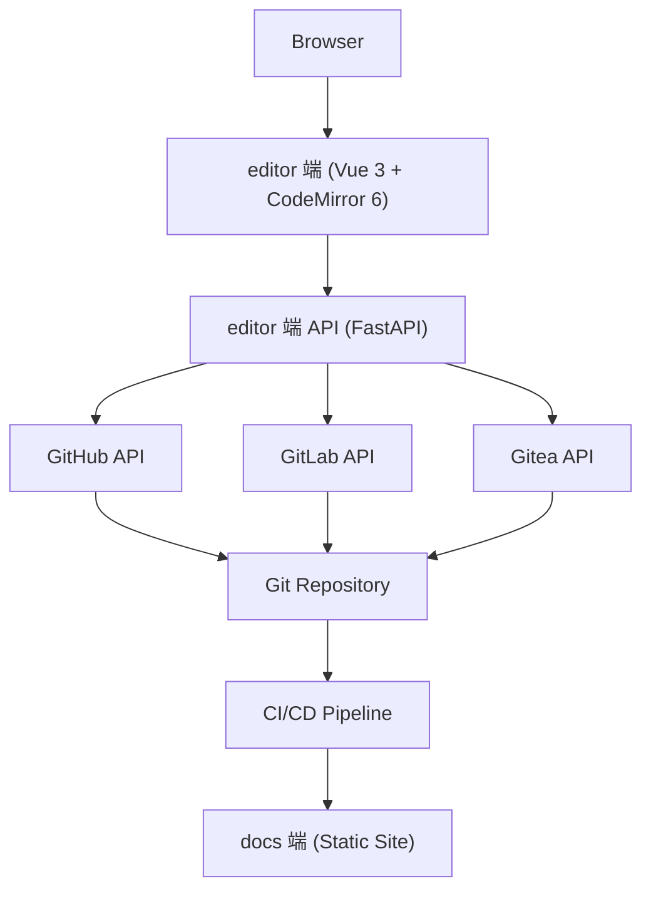
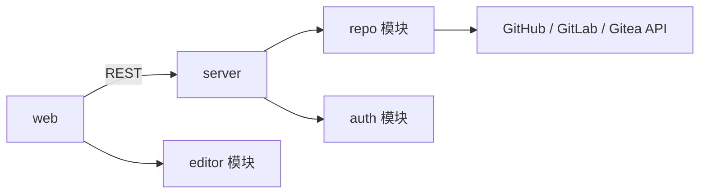

# RepoPress

[](https://python.org)
[](LICENSE)

> The Missing CMS Layer for Git-Based Documentation.
>
> Edit docs online, publish through Git.

RepoPress 在 Git 仓库和静态文档站之间搭一层 CMS。连接仓库后，在线编辑 Markdown/MDX、实时预览、提交审核——不改动原有的 VitePress / Rspress / Docusaurus / MkDocs Material 项目。

------

## Quick Start

```bash
# 后端
cd server
pip install -e .
python cli.py createsuperuser    # 创建管理员
python cli.py start              # 启动 → http://localhost:8000

# 前端
cd web
pnpm install
pnpm dev                          # 启动 → http://localhost:5173
```

打开 `http://localhost:5173`，用管理员账户登录。进入管理后台添加仓库，只需填：

```
Git URL  → https://github.com/team/docs.git
Docs 目录 → docs/
SSG 类型  → vitepress
```

添加后，切换至编辑器即可浏览文件树、在线编辑。可添加多个仓库，每个独立配置。

docs 端集成：在 SSG 配置中将 `editLink` 指向 `https://<host>/edit/<repo-id>/:path`，文档页的"编辑"按钮即切换到 RepoPress。

**VitePress** — `.vitepress/config.ts`

```typescript
export default defineConfig({
  themeConfig: {
    editLink: {
      pattern: 'https://repopress.example.com/edit/my-docs/:path'
    }
  }
})
```

<details>
<summary>其他 SSG</summary>

**Docusaurus** — `docusaurus.config.js`

```javascript
module.exports = {
  presets: [
    [
      'classic',
      {
        docs: {
          editUrl: 'https://repopress.example.com/edit/my-docs/'
        }
      }
    ]
  ]
}
```

**Rspress** — `rspress.config.ts`

```typescript
export default defineConfig({
  themeConfig: {
    editLink: {
      docRepoBaseUrl: 'https://repopress.example.com/edit/my-docs'
    }
  }
})
```

**MkDocs Material** — `mkdocs.yml`

```yaml
edit_uri: https://repopress.example.com/edit/my-docs/docs/
```

</details>

------

## 解决的问题

非开发人员改文档要走 Git CLI + PR 流程，学习成本高。RepoPress 用在线编辑替代：

**之前**：发现错误 → Clone 仓库 → 本地编辑 → Commit → Push → Create PR → Code Review → Merge

**之后**：发现错误 → 在线编辑 → 保存 → Merge

核心原则：**Git 是唯一数据源**。RepoPress 不存文档内容——文档始终在用户的 Git 仓库里，editor 端的数据库只管用户、权限和系统配置。

------

## 功能

**在线编辑** — CodeMirror 6 驱动的 Markdown/MDX 源码编辑器。语法高亮、自动补全（链接/图片路径/FrontMatter 字段）、工具栏、快捷键和命令面板。

**文件管理** — 侧边栏展示仓库完整文件树。右键新建/重命名/删除文件或文件夹，拖拽移动，变更状态实时标记。

**实时预览** — 左右分屏，左侧编辑右侧即时渲染。支持 Mermaid 图表和 KaTeX 公式，编辑停止 300ms 后自动刷新。

**Git 提交** — 保存即生成 Commit 并推送。两种模式：Direct（直推默认分支）和 Review（创建分支 + PR）。消息模板可配，遵循 Conventional Commits。

**权限管理** — RBAC 三级角色（Admin / Editor / Viewer），权限可细化到目录（`docs/dev/**`）。支持用户组。鉴权模式可选：`open` 无需登录即可编辑，`authenticated` 需登录后按角色控制。

------

## 架构

### 系统架构



### 项目结构

```
repopress/
├── server/   — FastAPI 后端
└── web/      — Vue 3 前端
```



### 技术栈

| 层 | 选型 |
|----|------|
| 前端 | Vue 3 + TypeScript + Vite + Pinia + Vue Router 4 |
| 编辑器 | CodeMirror 6 + markdown-it + Mermaid.js + KaTeX |
| UI | Naive UI + UnoCSS |
| HTTP | ofetch |
| 后端 | FastAPI + Tortoise-ORM + Aerich + Poetry |
| 数据库 | SQLite |
| Git | GitPython + httpx |
| 认证 | JWT + bcrypt |

------

## 配置

`config.py`：

```python
class Settings:
    # 服务
    host: str = "0.0.0.0"
    port: int = 8000
    debug: bool = False

    # 数据库
    database_url: str = "sqlite:///data/repopress.db"

    # 认证
    auth_mode: str = "authenticated"  # "open" | "authenticated"
    jwt_secret: str
    jwt_algorithm: str = "HS256"
    jwt_expire_minutes: int = 60

    # Git
    git_clone_dir: Path
    git_default_branch: str = "main"

    # 上传
    upload_dir: Path
    max_upload_size: int = 10 * 1024 * 1024
```

- `auth_mode = "open"`：跳过登录，Git 提交使用访客名称
- `auth_mode = "authenticated"`：需登录，按角色和目录权限控制

管理员通过 CLI 创建（不开放注册）：

```bash
python cli.py createsuperuser
```

之后在管理界面创建其他用户并分配角色和目录权限。

------

## 模块设计

### Server

```
server/
├── cli.py           # start / stop / restart / createsuperuser
├── main.py          # FastAPI 入口 + 路由
├── config.py        # 配置
├── middleware.py     # auth / cors / logging / rate_limit
├── models.py        # Tortoise-ORM 模型
├── schemas.py       # Pydantic schema
├── services.py      # 业务逻辑
├── migrations/      # Aerich
├── tests/
└── pyproject.toml
```

### Web

```
web/
├── src/
│   ├── main.ts          # 入口
│   ├── App.vue          # 根组件 + 布局
│   ├── router.ts        # 路由
│   ├── stores.ts        # Pinia stores
│   ├── api.ts           # ofetch 客户端 + API 调用
│   ├── composables.ts   # useAuth / useEditor / usePreview / useFileTree
│   ├── views/           # Login.vue / Editor.vue / Admin*.vue
│   ├── components/      # Header / Sidebar / FileTree / MarkdownEditor / PreviewPanel / Toolbar
│   └── styles/          # 全局样式
├── index.html
├── vite.config.ts
├── tsconfig.json
└── package.json
```

路由：

```
/login                     → Login.vue
/editor/:repoId/**         → Editor.vue
/admin/repos               → AdminRepos.vue
/admin/users               → AdminUsers.vue
/admin/permissions         → AdminPerms.vue
/admin/settings            → AdminSettings.vue
```

编辑器布局：左侧 FileTree，中间 CodeMirror 6 编辑区，右侧 PreviewPanel。

构建产物：

| Chunk | gzip |
|-------|------|
| vendor (Vue + Router + Pinia) | ~120KB |
| ui (Naive UI 按需) | ~80KB |
| codemirror (CM6 + Markdown) | ~50KB |
| app (业务代码) | ~40KB |

### Auth

```
用户请求 → 解析 JWT → 获取角色和权限 → 路径匹配 → 放行 / 403
```

三级角色：Admin（全局管理和用户管理）、Editor（创建和编辑文档）、Viewer（只读）。

权限用 glob 模式匹配目录：`docs/dev/**`、`docs/product/**`。

数据模型：

```python
class User(Model):
    id = fields.UUIDField(pk=True)
    username = fields.CharField(max_length=64, unique=True)
    email = fields.CharField(max_length=128, unique=True)
    display_name = fields.CharField(max_length=128)
    hashed_password = fields.CharField(max_length=256)
    is_active = fields.BooleanField(default=True)
    is_superuser = fields.BooleanField(default=False)
    created_at = fields.DatetimeField(auto_now_add=True)
    updated_at = fields.DatetimeField(auto_now=True)

class Role(Model):
    id = fields.UUIDField(pk=True)
    name = fields.CharField(max_length=32)        # admin / editor / viewer
    is_system = fields.BooleanField(default=False)

class Permission(Model):
    id = fields.UUIDField(pk=True)
    user = fields.ForeignKeyField("models.User", null=True)
    group = fields.ForeignKeyField("models.UserGroup", null=True)
    role = fields.ForeignKeyField("models.Role")
    path_pattern = fields.CharField(max_length=256)  # glob

class UserGroup(Model):
    id = fields.UUIDField(pk=True)
    name = fields.CharField(max_length=64)
```

安全措施：JWT 60min 有效期 + Refresh Token、bcrypt/argon2 密码哈希、登录限流 5 次/分钟/IP、登出 Token 黑名单。

### Repo

```python
class GitProvider(ABC):
    @abstractmethod
    async def get_file(path: str, ref: str = None) -> FileInfo: ...
    @abstractmethod
    async def create_or_update_file(path: str, content: str, message: str, branch: str) -> CommitResult: ...
    @abstractmethod
    async def create_branch(name: str, base: str) -> Branch: ...
    @abstractmethod
    async def create_pr(title: str, head: str, base: str, body: str = "") -> PullRequest: ...
    @abstractmethod
    async def get_file_history(path: str) -> list[Commit]: ...

class GitHubProvider(GitProvider): ...
class GitLabProvider(GitProvider): ...
class GiteaProvider(GitProvider): ...
```

仓库配置模型 `RepoConfig` 记录 Git URL、docs 目录、SSG 类型、Commit 模板、Review 模式等。Access Token 使用 AES-256-GCM 加密，所有 Git 操作服务端代理，不暴露给前端。

文档操作流程：

```
GET  /api/docs/{path}  → repo.get_file(path)         → 返回 { content, sha }
POST /api/docs/save    → repo.create_or_update_file() → Direct: 直推 / Review: 分支+PR
```

### Editor

CodeMirror 6 模块化组装：`@codemirror/lang-markdown`（语法高亮）+ `@codemirror/autocomplete`（补全）+ `@codemirror/language-data`（代码块高亮）+ `@codemirror/search`（搜索替换）。

| 触发 | 补全内容 |
|------|----------|
| `[[` | 内部文档路径 |
| `![` | 图片选择器 |
| `---` | FrontMatter 模板 |
| ` ``` ` | 代码块语言 |

快捷键：`Ctrl+S` 保存 · `Ctrl+B/I/K` 加粗/斜体/链接 · `Ctrl+Shift+K` 图片 · `Ctrl+Z/Y` 撤销重做 · `Ctrl+F/H` 搜索替换 · `Ctrl+Shift+P` 命令面板

FrontMatter 支持表单（字段化编辑）和源码（直接 YAML）两种模式切换。自动保存：停止编辑 2 秒后写 localStorage，手动保存提交服务器。

------

## API

### `/api/docs/`

| 方法 | 路径 | 说明 |
|------|------|------|
| GET | `/api/docs/{path}` | 获取文档 |
| POST | `/api/docs/save` | 创建/保存 |
| DELETE | `/api/docs/{path}` | 删除 |
| POST | `/api/docs/rename` | 重命名/移动 |
| GET | `/api/docs/{path}/history` | 历史记录 |
| GET | `/api/docs/tree` | 文件目录树 |

### `/api/auth/`

| 方法 | 路径 | 说明 |
|------|------|------|
| POST | `/api/auth/login` | 登录 |
| POST | `/api/auth/logout` | 登出 |
| GET | `/api/auth/user` | 当前用户 |

### `/api/admin/`

| 方法 | 路径 | 说明 |
|------|------|------|
| POST | `/api/admin/repos` | 添加仓库 |
| GET | `/api/admin/repos` | 仓库列表 |
| PUT | `/api/admin/repos/{id}` | 更新仓库配置 |
| GET | `/api/admin/users` | 用户列表 |
| PUT | `/api/admin/permissions` | 权限配置 |

------

## License

[Apache 2.0](LICENSE)
